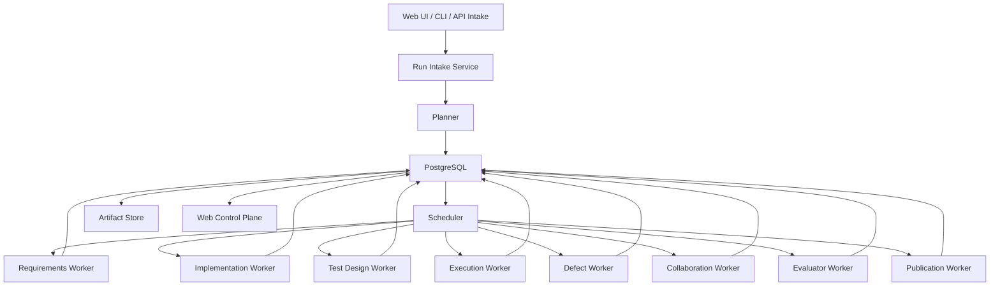

# Agent Orchestration Platform Design

- Status: active
- Source of truth: `AGENTS.md`, `llms.txt`, `docs/architecture.md`, `docs/usage-guide.md`, `packages/cli/src/planning/task-graph-service.ts`, `packages/cli/src/runtime/workflow-loop-service.ts`, `packages/cli/src/runtime/task-result-service.ts`, `packages/cli/src/platform/platform-project-service.ts`, `packages/cli/src/platform/platform-auto-runner-service.ts`
- Verified with: `npm run build`, `npm run test:unit`, `npm run validate:docs`
- Last verified: 2026-03-26
- Supersedes: `synapse-integration-automation-design.md`

## Goal

Define how Spec2Flow should evolve from a file-backed CLI orchestration framework into a platform that can:

1. accept one user task and persist it as durable runtime truth
2. decompose it into stage-scoped workflow subtasks without manual orchestration
3. execute the full engineering loop under scheduler and policy control without human babysitting
4. automatically repair, reroute, retry, or escalate when defects appear in the middle of execution
5. promote validated work into an evaluator-owned acceptance decision instead of worker self-certification
6. automatically commit and submit a PR when validation passes and policy allows publication
7. expose the entire run, task, artifact, and policy state through a PostgreSQL-backed web control plane

The product target is clear:

- unattended execution
- fully autonomous closed-loop delivery
- humans only enter the loop when policy, risk, or approval gates require intervention

The target automation chain is explicit:

1. UI or CLI submits one task
2. the controller decomposes it into route-scoped tasks and execution steps
3. implementation workers change code
4. test-design and automated-execution workers run validation and unit tests
5. evaluator-owned acceptance decides whether the result is accepted or sent back for repair
6. when validation passes and policy allows publication, the system automatically commits and submits a PR

## Autonomy Acceptance Criteria

Spec2Flow does not meet the product goal just because it can run tasks automatically.
It only qualifies as `无人值守，全自治闭环` when all of the following are true at the same time:

1. intake is self-starting
    A registered project can accept one user task and create a durable run without manual file surgery, ad-hoc shell recovery, or operator-written database patches.
2. runtime truth is durable
    Run state, task state, retries, approvals, publications, and artifacts are recoverable from controller-owned storage rather than hidden in model memory, terminal scrollback, or one local JSON file.
3. forward progress is scheduler-driven
    Ready work is leased, heartbeated, retried, expired, and resumed by platform logic rather than by a human repeatedly restarting commands or watching logs.
4. defect handling is closed-loop
    When execution fails, the controller can classify the failure, route repair back to the owning stage, rerun downstream dependents, and stop only when policy says to stop.
5. publication is policy-governed
    Collaboration outcomes such as auto-commit, PR draft, or blocked handoff are decided deterministically from risk and approval policy, not from operator improvisation.
6. humans are exception handlers, not workflow drivers
    Human intervention happens only at explicit gates such as approval, risk escalation, missing credentials, or irrecoverable platform faults.
7. observability is reconstruction-grade
    An operator can reconstruct why a run is blocked, retrying, published, or failed from the control-plane APIs and artifacts without attaching a debugger to the worker process.

If any one of these criteria fails, the system is not yet at the target autonomy bar.

## Decision Summary

The current design is directionally correct, but not yet sufficient as a production-grade agent scheduling platform.

What already fits the target:

- Spec2Flow already treats the controller as the system of record.
- The task graph already expands one request into stage-scoped subtasks.
- The runtime already persists execution state outside model memory.
- The result pipeline already supports defect routing and stage-specific specialists.
- Project registration now persists adapter runtime and capability references so the scheduler can reuse durable project truth instead of depending only on late `.spec2flow/model-adapter-runtime.json` discovery.
- Control-plane operators can now update or clear a registered project's adapter profile without re-registering the project, so scheduler truth is operationally mutable through the API instead of only at registration time.
- The planner and runtime already model an evaluator stage, which is the right control-plane boundary for final acceptance.
- Evaluator `needs-repair` decisions now re-enter the controller loop automatically, and `evaluation-summary.repairTargetStage` gives the controller an explicit schema-backed reroute target. `findings` and `nextActions` remain as compatibility signals when older adapters do not emit the explicit field.

What is still missing:

- a durable multi-run store beyond local JSON files
- a scheduler that can lease work to many workers safely
- a first-class intake surface for user-submitted tasks
- a richer event model surfaced through operator APIs or streaming for progress, retries, artifacts, publication, and approvals
- an evaluator-owned acceptance layer that decides final completion instead of letting workers self-certify delivery
- a governed publish path that can automatically commit and open a PR after evaluator acceptance
- an auto-repair loop with explicit retry budgets and stop conditions

Conclusion:

- for local rehearsal and architecture proof, the current design already works
- for a real agent scheduling platform, Spec2Flow should keep the current controller boundary and add database-backed scheduling, worker coordination, and a web console

## Current-State Assessment

## What Already Works

The current CLI and runtime model already establish the most important architectural boundary:

- the controller owns `task-graph.json` and `execution-state.json`
- providers run only one claimed task at a time
- stage roles are explicit
- failures can route into `defect-feedback`
- collaboration remains policy-gated instead of being mixed into implementation

This is exactly the right control-plane foundation.

The strongest existing signals are:

- `packages/cli/src/planning/task-graph-service.ts` already expands one route into `requirements-analysis -> code-implementation -> test-design -> automated-execution -> defect-feedback -> collaboration`
- `packages/cli/src/runtime/task-result-service.ts` already reroutes failures by stage and can skip or unlock downstream tasks
- `packages/cli/src/runtime/workflow-loop-service.ts` already behaves like a minimal scheduler loop

## What Does Not Yet Satisfy The Product Goal

The current implementation still behaves like a local file-backed workflow runner, not a shared platform:

- run state lives in one local JSON file instead of PostgreSQL
- claiming is local and does not use worker leases or heartbeat-based locking
- there is no first-class run intake API for "submit one task"
- there is no streaming or operator-facing API surface for live UI progress, even though durable platform events and observability snapshots now exist
- there is no explicit auto-fix policy such as retry budget, repair budget, or escalation threshold
- there is no publish action for `git commit`, branch creation, or PR draft creation
- there is no multi-user or multi-run operations surface

So the answer is precise:

- the present design satisfies the orchestration philosophy
- the present implementation does not yet satisfy the full autonomous platform requirement

## Execution Plan From Gap Matrix

The gap matrix only matters if it becomes a shipping plan.
For this product, the correct unit of execution is not a giant phase but one narrowly-scoped commit slice that improves the autonomy bar without blurring module boundaries.

### Priority Model

- `P0`: blocks `无人值守，全自治闭环` directly; until these slices land, the product still needs human babysitting
- `P1`: makes the closed loop reliable and operator-usable at real project scale
- `P2`: improves scale, ergonomics, and product polish after the autonomy bar is functionally cleared

### Commit-Slice Plan

| Priority | Capability track | Primary modules | Commit slice | Expected outcome | Validation path |
| --- | --- | --- | --- | --- | --- |
| P0 | Durable runtime truth | `packages/cli/src/platform/platform-repository.ts`, `packages/cli/src/platform/platform-scheduler-service.ts`, `packages/cli/src/platform/platform-control-plane-service.ts`, `packages/cli/src/runtime/execution-state-service.ts` | move remaining runtime-critical fields from local JSON-only flow into PostgreSQL-backed controller records | run, task, approval, publication, and repair state can be reconstructed without reading mutable local runtime files | `npm run build`, `npm run test:unit` |
| P0 | Shared scheduler hardening | `packages/cli/src/platform/platform-scheduler-service.ts`, `packages/cli/src/platform/platform-auto-runner-service.ts`, `packages/cli/src/platform/platform-worker-service.ts`, `packages/cli/src/platform/platform-database.ts` | add production-grade lease expiry recovery, dead-letter handling, and multi-worker-safe claim semantics | forward progress becomes scheduler-owned instead of terminal-owned | `npm run build`, targeted scheduler and worker tests |
| P0 | Closed-loop repair enforcement | `packages/cli/src/runtime/auto-repair-policy-service.ts`, `packages/cli/src/platform/platform-auto-repair-service.ts`, `packages/cli/src/runtime/task-result-service.ts`, `packages/cli/src/platform/platform-scheduler-service.ts` | enforce repair budgets, downstream invalidation, and resumable rerun routing as default controller behavior | execution failures re-enter the owning stage automatically until policy budget is exhausted | `npm run build`, targeted auto-repair and task-result tests |
| P0 | Evaluator-owned acceptance | `packages/cli/src/planning/task-graph-service.ts`, `packages/cli/src/runtime/task-result-service.ts`, `packages/cli/src/platform/platform-control-plane-service.ts`, `packages/cli/src/platform/platform-observability-service.ts`, evaluator adapter/runtime surfaces | make evaluator decisions the only authority for route acceptance, rejection, or repair re-entry | the system stops treating worker self-reporting as completion truth and gains a hard final acceptance layer before publish is considered finished | `npm run build`, targeted planning and task-result tests, smallest evaluator acceptance regression |
| P0 | Governed publication execution | `packages/cli/src/runtime/collaboration-publication-service.ts`, `packages/cli/src/platform/platform-publication-service.ts`, `packages/cli/src/platform/platform-control-plane-action-service.ts`, git provider integration surfaces | turn publication from record-only behavior into deterministic commit / PR draft / blocked handoff execution | collaboration becomes a real autonomous endpoint instead of a documentation artifact | `npm run build`, targeted publication tests, smallest publish-path regression |
| P0 | Human-on-exception control plane | `packages/cli/src/platform/platform-control-plane-server.ts`, `packages/cli/src/platform/platform-control-plane-service.ts`, `packages/web/src/**` | move pause, resume, retry, approval, remediation, and recovery actions fully into API and operator UI | humans intervene through explicit control-plane actions instead of ad-hoc shell and SQL recovery | `npm run build`, `npm run test:unit`, smallest API/UI action regression |
| P1 | Self-serve intake completion | `packages/cli/src/platform/platform-project-service.ts`, `packages/cli/src/platform/platform-control-plane-run-submission-service.ts`, `packages/cli/src/platform/platform-control-plane-server.ts`, `packages/web/src/**` | add project detail, stronger intake validation, repository binding UX, and task submission ergonomics | one registered project can accept work cleanly through API or UI without operator improvisation | `npm run build`, targeted project/intake tests, `npm run validate:docs` |
| P1 | Reconstruction-grade observability | `packages/cli/src/platform/platform-observability-service.ts`, `packages/cli/src/platform/platform-event-taxonomy.ts`, `packages/cli/src/platform/platform-control-plane-service.ts`, `packages/web/src/**` | close event taxonomy gaps and surface approval, publication, repair, and causal failure summaries | any blocked or failed run explains itself from the control plane without worker-process debugging | `npm run build`, targeted observability tests |
| P1 | Project-scoped runtime isolation | `packages/cli/src/platform/platform-project-service.ts`, `packages/cli/src/platform/platform-control-plane-run-submission-service.ts`, `packages/cli/src/platform/platform-auto-runner-service.ts`, `packages/cli/src/platform/platform-project-adapter-profile.ts` | remove remaining single-repo assumptions and tighten project-scoped adapter/runtime resolution | many projects can run concurrently without hidden local-first coupling | `npm run build`, targeted multi-project regression tests |
| P2 | Operator console productization | `packages/web/src/**`, `docs/ui/operator-console.md`, `docs/ui/visual-language.md`, `packages/cli/src/platform/platform-control-plane-server.ts` | promote the current web shell into a real operator console for intake, DAG inspection, approvals, and recovery | the autonomy layer becomes usable as a product, not just as backend plumbing | `npm run build`, web-specific tests, `npm run validate:docs` |
| P2 | Policy and autonomy auditability | `packages/cli/src/runtime/review-policy-service.ts`, `packages/cli/src/platform/platform-control-plane-service.ts`, `packages/cli/src/platform/platform-observability-service.ts` | expose why policy allowed repair, blocked publish, or required human approval as first-class read models | autonomy decisions become auditable instead of implicit | `npm run build`, targeted policy and observability tests |

### Recommended Shipping Order

1. clear `P0` scheduler hardening and runtime-truth slices first
2. land evaluator-owned acceptance before treating collaboration or publish success as final completion
3. land closed-loop repair and governed publication next so the loop can finish without human babysitting
4. eliminate shell-and-SQL recovery paths through API and UI control surfaces
5. only then spend effort on P1 intake and observability completeness
6. treat P2 as productization, not as the blocker for autonomy itself

### Rule For Future Work

Every future autonomy-facing change should answer four questions before it ships:

1. which autonomy criterion does this slice raise?
2. which module owns the behavior?
3. what is the smallest commit that moves that behavior into controller truth?
4. which validation path proves the slice actually reduced human babysitting?

If a proposed change cannot answer those four questions, it is probably architecture theater rather than progress toward the product goal.

## Product Shape

Spec2Flow should stay a control plane, not collapse into one giant autonomous coding agent.

The target product shape is:

1. intake receives one user task
2. planner generates one run, a stage-aware DAG, and explicit execution steps
3. scheduler leases ready tasks to specialist workers
4. workers write structured artifacts and execution evidence
5. policy engine decides retry, reroute, block, or publish
6. collaboration stage prepares the publishable delivery packet
7. evaluator stage decides whether the run is accepted, rejected, or sent back for repair
8. publication stage automatically commits code and submits a PR when evaluator acceptance and policy conditions are satisfied
9. web console shows the run, tasks, artifacts, approval gates, evaluator decisions, and publication status

The six-stage public workflow should stay stable:

1. requirements analysis
2. code implementation
3. test design
4. automated execution
5. defect feedback
6. collaboration workflow

`environment-preparation` should remain a controller-owned preflight stage, not the main product headline.

## Proposed Architecture

## Core Services

### 1. Intake Service

Responsibilities:

- accept a task from CLI, API, or Web UI
- resolve repository, branch, risk policy, and workflow template
- create `runId`
- store the raw request and normalized request context

Inputs:

- free-form task text
- optional requirement file or changed-file scope
- repository binding
- requested automation mode

Outputs:

- `runs` row
- normalized intake event
- planner job

### 2. Planner

Responsibilities:

- match workflow routes
- split the request into stage-scoped tasks
- assign specialist role, target files, verify commands, and review policy
- create the initial DAG in durable storage

This should reuse the current task-graph logic rather than replace it.

### 3. Scheduler

Responsibilities:

- find ready tasks
- lease tasks to workers
- handle timeout, heartbeat, retry, and dead-letter logic
- enforce stage ordering and defect loop routing

This is the missing platform core.

The current `run-workflow-loop` command is a good prototype, but it is not a shared scheduler yet.

### 4. Stage Workers

Workers remain stage-specialized:

- `requirements-agent`
- `implementation-agent`
- `test-design-agent`
- `execution-agent`
- `defect-agent`
- `collaboration-agent`
- `evaluator-agent`
- `publication-agent`

Each worker should receive only one leased task plus structured upstream artifacts.

The evaluator is not optional garnish.
It is the controller-owned acceptance layer that prevents implementation or collaboration workers from self-certifying completion.

### 5. Policy Engine

Responsibilities:

- decide whether automatic repair is allowed
- enforce risk-based human approval
- cap retry counts
- decide whether collaboration may commit code automatically

This should remain deterministic and repository-driven.

### 6. Publication Service

Responsibilities:

- convert evaluator acceptance plus publication policy into deterministic commit and PR actions
- create commit metadata, branch metadata, PR body, and publication audit records
- block publication when approval, credentials, or repository policy do not allow autonomous publish

This service is what turns a successful autonomous run into a real delivery outcome instead of a local artifact.

### 7. Artifact Service

Responsibilities:

- store logs, reports, screenshots, traces, patches, and collaboration handoff artifacts
- keep artifact metadata in PostgreSQL
- keep large blobs in filesystem or object storage

## Automatic Bug-Fix Loop

The requirement says that bugs found in the middle should be fixed automatically when possible.

Spec2Flow should support that, but with policy gates.

Recommended loop:

1. `automated-execution` fails
2. controller classifies the failure
3. if failure is repairable and repair budget remains, enqueue a repair task back to the owning stage
4. rerun downstream tasks that depend on the repaired task
5. stop after the configured retry budget
6. escalate to human review when the budget is exhausted or the risk policy forbids auto-repair

Recommended repair routing:

- requirement misunderstanding -> back to `requirements-analysis`
- implementation bug -> back to `code-implementation`
- weak coverage -> back to `test-design`
- flaky environment or command issue -> back to `automated-execution`

Required policy fields:

- `maxAutoRepairAttempts`
- `maxExecutionRetries`
- `allowAutoCommit`
- `requireHumanApproval`
- `blockedRiskLevels`

This keeps the loop powerful without letting it become an infinite hallucination machine.

## Collaboration And Code Submission

The user requirement includes "then submit code".

That should stay inside the collaboration stage rather than become a separate top-level architecture.

Recommended collaboration-stage actions:

1. write collaboration handoff artifact
2. prepare the publish-ready summary, change packet, and PR intent
3. hand publication inputs to the evaluator and publication services

Recommended rule:

- low-risk tasks may auto-commit and auto-open a PR
- medium-risk tasks may auto-open a PR but still require review gates
- high-risk and critical tasks should default to human approval before autonomous publish

Spec2Flow should own the decision and audit trail.
The git provider should only execute the action.

## Evaluation And Acceptance

Autonomous delivery is not complete when collaboration finishes.
It is complete only when an evaluator-owned decision turns the run into one of three controller-truth outcomes:

1. `accepted`
2. `rejected`
3. `needs-repair`

Recommended evaluator-stage responsibilities:

- inspect execution evidence, defect history, collaboration output, and publication state
- verify that required artifacts exist and are internally consistent
- decide whether the route output meets acceptance criteria
- send the run back into repair when quality is not yet sufficient, preferably by emitting an explicit `evaluation-summary.repairTargetStage`
- prevent implementation or collaboration workers from marking the route done by self-assertion

Evaluator acceptance is the gate in front of autonomous publication.
Without an `accepted` decision, the system should not commit success to the publication layer.

This is the critical distinction between a task runner and a real autonomous control plane.
Without evaluator-owned completion, the system still leaks final judgment back into worker self-reporting.

## Autonomous Publication

The target system does not stop at "tests passed".
It must convert successful autonomous execution into a real delivery action.

Recommended publication-stage responsibilities:

- verify evaluator outcome is `accepted`
- verify publication policy permits autonomous publish for the current risk level
- create or update the working branch
- create a deterministic commit
- submit a PR with run summary, evidence, and review metadata
- persist commit SHA, branch name, PR URL, and publication status as controller truth

This is the last mile of the full automatic chain:

1. task submitted
2. tasks decomposed
3. code implemented
4. tests executed
5. evaluator accepts
6. controller submits PR

## Web Console

Yes, a web page is worth building.

But the web page should be a control surface, not the orchestration core.

The correct boundary is:

- CLI and workers remain valid automation entrypoints
- PostgreSQL becomes the shared source of truth for runs and tasks
- the web app reads and mutates the same durable state through APIs

The web console should support:

- submit a new task
- list runs by status, repository, and risk level
- show the DAG and current stage
- stream task events and artifacts
- display approval gates
- allow retry, pause, resume, or cancel
- show generated requirement summaries, test plans, execution reports, and bug drafts
- show evaluator decisions, commit SHA, branch, and PR link when autonomous publication runs

Without this console, operators will be blind once many runs and workers exist.

## PostgreSQL Design

PostgreSQL should become the platform system of record for shared runtime state.

Recommended tables:

### `repositories`

- repository identity
- default branch
- local or remote binding
- runtime configuration refs

### `runs`

- `run_id`
- repository id
- raw task text
- normalized request
- workflow name
- overall status
- current stage
- risk level
- created by
- timestamps

### `tasks`

- `task_id`
- `run_id`
- stage
- specialist role
- goal
- status
- dependency metadata
- retry counters
- review policy snapshot
- target files
- verify commands

### `task_attempts`

- attempt number
- worker id
- lease start and expiry
- adapter runtime used
- model and session metadata
- result summary

### `artifacts`

- artifact id
- `run_id`
- `task_id`
- kind
- path or object key
- schema type
- created at

### `events`

- event id
- `run_id`
- optional `task_id`
- event type
- payload JSONB
- created at

### `review_gates`

- gate id
- `run_id`
- `task_id`
- reason
- required approver type
- status

### `publications`

- `run_id`
- branch name
- commit SHA
- PR URL
- publish mode
- publication status

The existing JSON documents should still exist as exportable artifacts or local-dev mode fixtures, but not as the only durable runtime state.

## State Model

Recommended run statuses:

- `pending`
- `planning`
- `running`
- `awaiting-approval`
- `completed`
- `failed`
- `cancelled`

Recommended task statuses:

- `pending`
- `ready`
- `leased`
- `in-progress`
- `retryable-failed`
- `blocked`
- `completed`
- `skipped`
- `cancelled`

`leased` is important once many workers exist.
The current local file model does not need it, but the platform model does.

## API And UI Surface

Recommended minimal API:

- `POST /api/runs`
- `GET /api/runs`
- `GET /api/runs/:runId`
- `GET /api/runs/:runId/tasks`
- `POST /api/runs/:runId/actions/pause`
- `POST /api/runs/:runId/actions/resume`
- `POST /api/tasks/:taskId/actions/retry`
- `POST /api/tasks/:taskId/actions/approve`
- `POST /api/tasks/:taskId/actions/reject`
- `POST /api/runs/:runId/actions/publish`
- `GET /api/runs/:runId/publication`

The UI can start very small:

1. run submission form
2. run list
3. run detail with DAG visualization
4. task detail drawer with logs and artifacts

## Compatibility With Current Docs

This design keeps the current repository philosophy intact:

- Spec2Flow remains the orchestrator
- adapters remain provider-specific
- model sessions remain non-authoritative
- docs and schemas remain first-class product surfaces

So this is not a pivot.
It is the missing production layer on top of the current architecture.

## Incremental Delivery Plan

### Phase 1. Shared Runtime State

- add PostgreSQL-backed run and task persistence
- keep current JSON outputs as exported artifacts
- add worker lease semantics

### Phase 2. Scheduler And Worker Runtime

- extract the workflow loop into a real scheduler service
- add heartbeat, retry budget, and dead-letter handling
- add event emission

### Phase 3. Collaboration Publish Path

- add branch creation, commit, and PR draft support
- connect publish actions to risk policy and review gates

### Phase 4. Web Control Plane

- add run submission page
- add DAG and task-progress view
- add approval and retry controls

### Phase 5. Auto-Repair Hardening

- add failure classification rules
- add repair budgets
- add loop safety and observability metrics

## Final Recommendation

Spec2Flow should become a web-visible, PostgreSQL-backed agent orchestration platform.

But the winning move is not to replace the current CLI control plane.
The winning move is to preserve the current orchestration boundary and promote it into three stronger surfaces:

1. PostgreSQL-backed runtime truth
2. scheduler-plus-worker execution
3. web control plane for humans

That path is the cleanest upgrade from the current design to the platform described by the product requirement.
