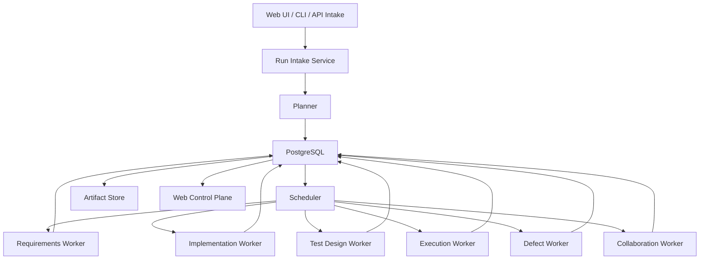

# Agent Orchestration Platform Design

- Status: active
- Source of truth: `AGENTS.md`, `llms.txt`, `docs/architecture.md`, `docs/usage-guide.md`, `packages/cli/src/planning/task-graph-service.ts`, `packages/cli/src/runtime/workflow-loop-service.ts`, `packages/cli/src/runtime/task-result-service.ts`
- Verified with: `npm run build`, `npm run test:unit`, `npm run validate:docs`

## Goal

Define how Spec2Flow should evolve from a file-backed CLI orchestration framework into a platform that can:

1. accept one user task
2. decompose it into workflow subtasks
3. run the six-stage engineering loop
4. automatically loop on defects when policy allows
5. commit or hand off code changes through a governed collaboration stage
6. expose run state through a web control plane backed by PostgreSQL

## Decision Summary

The current design is directionally correct, but not yet sufficient as a production-grade agent scheduling platform.

What already fits the target:

- Spec2Flow already treats the controller as the system of record.
- The task graph already expands one request into stage-scoped subtasks.
- The runtime already persists execution state outside model memory.
- The result pipeline already supports defect routing and stage-specific specialists.

What is still missing:

- a durable multi-run store beyond local JSON files
- a scheduler that can lease work to many workers safely
- a first-class intake surface for user-submitted tasks
- a richer event model surfaced through operator APIs or streaming for progress, retries, artifacts, publication, and approvals
- a governed publish path for commit or PR creation
- an auto-repair loop with explicit retry budgets and stop conditions

Conclusion:

- for local rehearsal and architecture proof, the current design already works
- for a real agent scheduling platform, Spec2Flow should keep the current controller boundary and add database-backed scheduling, worker coordination, and a web console

## Current-State Assessment

## What Already Works

The current CLI and runtime model already establish the most important architectural boundary:

- the controller owns `task-graph.json` and `execution-state.json`
- providers run only one claimed task at a time
- stage roles are explicit
- failures can route into `defect-feedback`
- collaboration remains policy-gated instead of being mixed into implementation

This is exactly the right control-plane foundation.

The strongest existing signals are:

- `packages/cli/src/planning/task-graph-service.ts` already expands one route into `requirements-analysis -> code-implementation -> test-design -> automated-execution -> defect-feedback -> collaboration`
- `packages/cli/src/runtime/task-result-service.ts` already reroutes failures by stage and can skip or unlock downstream tasks
- `packages/cli/src/runtime/workflow-loop-service.ts` already behaves like a minimal scheduler loop

## What Does Not Yet Satisfy The Product Goal

The current implementation still behaves like a local file-backed workflow runner, not a shared platform:

- run state lives in one local JSON file instead of PostgreSQL
- claiming is local and does not use worker leases or heartbeat-based locking
- there is no first-class run intake API for "submit one task"
- there is no streaming or operator-facing API surface for live UI progress, even though durable platform events and observability snapshots now exist
- there is no explicit auto-fix policy such as retry budget, repair budget, or escalation threshold
- there is no publish action for `git commit`, branch creation, or PR draft creation
- there is no multi-user or multi-run operations surface

So the answer is precise:

- the present design satisfies the orchestration philosophy
- the present implementation does not yet satisfy the full autonomous platform requirement

## Product Shape

Spec2Flow should stay a control plane, not collapse into one giant autonomous coding agent.

The target product shape is:

1. intake receives one user task
2. planner generates one run and a stage-aware DAG
3. scheduler leases ready tasks to specialist workers
4. workers write structured artifacts and execution evidence
5. policy engine decides retry, reroute, block, or publish
6. collaboration stage commits code or prepares a PR handoff
7. web console shows the run, tasks, artifacts, and approval gates

The six-stage public workflow should stay stable:

1. requirements analysis
2. code implementation
3. test design
4. automated execution
5. defect feedback
6. collaboration workflow

`environment-preparation` should remain a controller-owned preflight stage, not the main product headline.

## Proposed Architecture

## Core Services

### 1. Intake Service

Responsibilities:

- accept a task from CLI, API, or Web UI
- resolve repository, branch, risk policy, and workflow template
- create `runId`
- store the raw request and normalized request context

Inputs:

- free-form task text
- optional requirement file or changed-file scope
- repository binding
- requested automation mode

Outputs:

- `runs` row
- normalized intake event
- planner job

### 2. Planner

Responsibilities:

- match workflow routes
- split the request into stage-scoped tasks
- assign specialist role, target files, verify commands, and review policy
- create the initial DAG in durable storage

This should reuse the current task-graph logic rather than replace it.

### 3. Scheduler

Responsibilities:

- find ready tasks
- lease tasks to workers
- handle timeout, heartbeat, retry, and dead-letter logic
- enforce stage ordering and defect loop routing

This is the missing platform core.

The current `run-workflow-loop` command is a good prototype, but it is not a shared scheduler yet.

### 4. Stage Workers

Workers remain stage-specialized:

- `requirements-agent`
- `implementation-agent`
- `test-design-agent`
- `execution-agent`
- `defect-agent`
- `collaboration-agent`

Each worker should receive only one leased task plus structured upstream artifacts.

### 5. Policy Engine

Responsibilities:

- decide whether automatic repair is allowed
- enforce risk-based human approval
- cap retry counts
- decide whether collaboration may commit code automatically

This should remain deterministic and repository-driven.

### 6. Artifact Service

Responsibilities:

- store logs, reports, screenshots, traces, patches, and collaboration handoff artifacts
- keep artifact metadata in PostgreSQL
- keep large blobs in filesystem or object storage

## Automatic Bug-Fix Loop

The requirement says that bugs found in the middle should be fixed automatically when possible.

Spec2Flow should support that, but with policy gates.

Recommended loop:

1. `automated-execution` fails
2. controller classifies the failure
3. if failure is repairable and repair budget remains, enqueue a repair task back to the owning stage
4. rerun downstream tasks that depend on the repaired task
5. stop after the configured retry budget
6. escalate to human review when the budget is exhausted or the risk policy forbids auto-repair

Recommended repair routing:

- requirement misunderstanding -> back to `requirements-analysis`
- implementation bug -> back to `code-implementation`
- weak coverage -> back to `test-design`
- flaky environment or command issue -> back to `automated-execution`

Required policy fields:

- `maxAutoRepairAttempts`
- `maxExecutionRetries`
- `allowAutoCommit`
- `requireHumanApproval`
- `blockedRiskLevels`

This keeps the loop powerful without letting it become an infinite hallucination machine.

## Collaboration And Code Submission

The user requirement includes "then submit code".

That should stay inside the collaboration stage rather than become a separate top-level architecture.

Recommended collaboration-stage actions:

1. write collaboration handoff artifact
2. if policy allows, create or update a working branch
3. create a deterministic `git commit`
4. optionally create a PR draft
5. block before merge when human approval is required

Recommended rule:

- low-risk tasks may auto-commit
- medium-risk tasks may auto-commit but require PR review
- high-risk and critical tasks should default to human approval before publish

Spec2Flow should own the decision and audit trail.
The git provider should only execute the action.

## Web Console

Yes, a web page is worth building.

But the web page should be a control surface, not the orchestration core.

The correct boundary is:

- CLI and workers remain valid automation entrypoints
- PostgreSQL becomes the shared source of truth for runs and tasks
- the web app reads and mutates the same durable state through APIs

The web console should support:

- submit a new task
- list runs by status, repository, and risk level
- show the DAG and current stage
- stream task events and artifacts
- display approval gates
- allow retry, pause, resume, or cancel
- show generated requirement summaries, test plans, execution reports, and bug drafts
- show commit SHA, branch, and PR link when collaboration runs

Without this console, operators will be blind once many runs and workers exist.

## PostgreSQL Design

PostgreSQL should become the platform system of record for shared runtime state.

Recommended tables:

### `repositories`

- repository identity
- default branch
- local or remote binding
- runtime configuration refs

### `runs`

- `run_id`
- repository id
- raw task text
- normalized request
- workflow name
- overall status
- current stage
- risk level
- created by
- timestamps

### `tasks`

- `task_id`
- `run_id`
- stage
- specialist role
- goal
- status
- dependency metadata
- retry counters
- review policy snapshot
- target files
- verify commands

### `task_attempts`

- attempt number
- worker id
- lease start and expiry
- adapter runtime used
- model and session metadata
- result summary

### `artifacts`

- artifact id
- `run_id`
- `task_id`
- kind
- path or object key
- schema type
- created at

### `events`

- event id
- `run_id`
- optional `task_id`
- event type
- payload JSONB
- created at

### `review_gates`

- gate id
- `run_id`
- `task_id`
- reason
- required approver type
- status

### `publications`

- `run_id`
- branch name
- commit SHA
- PR URL
- publish mode
- publication status

The existing JSON documents should still exist as exportable artifacts or local-dev mode fixtures, but not as the only durable runtime state.

## State Model

Recommended run statuses:

- `pending`
- `planning`
- `running`
- `awaiting-approval`
- `completed`
- `failed`
- `cancelled`

Recommended task statuses:

- `pending`
- `ready`
- `leased`
- `in-progress`
- `retryable-failed`
- `blocked`
- `completed`
- `skipped`
- `cancelled`

`leased` is important once many workers exist.
The current local file model does not need it, but the platform model does.

## API And UI Surface

Recommended minimal API:

- `POST /api/runs`
- `GET /api/runs`
- `GET /api/runs/:runId`
- `GET /api/runs/:runId/tasks`
- `POST /api/runs/:runId/actions/pause`
- `POST /api/runs/:runId/actions/resume`
- `POST /api/tasks/:taskId/actions/retry`
- `POST /api/tasks/:taskId/actions/approve`
- `POST /api/tasks/:taskId/actions/reject`

The UI can start very small:

1. run submission form
2. run list
3. run detail with DAG visualization
4. task detail drawer with logs and artifacts

## Compatibility With Current Docs

This design keeps the current repository philosophy intact:

- Spec2Flow remains the orchestrator
- adapters remain provider-specific
- model sessions remain non-authoritative
- docs and schemas remain first-class product surfaces

So this is not a pivot.
It is the missing production layer on top of the current architecture.

## Incremental Delivery Plan

### Phase 1. Shared Runtime State

- add PostgreSQL-backed run and task persistence
- keep current JSON outputs as exported artifacts
- add worker lease semantics

### Phase 2. Scheduler And Worker Runtime

- extract the workflow loop into a real scheduler service
- add heartbeat, retry budget, and dead-letter handling
- add event emission

### Phase 3. Collaboration Publish Path

- add branch creation, commit, and PR draft support
- connect publish actions to risk policy and review gates

### Phase 4. Web Control Plane

- add run submission page
- add DAG and task-progress view
- add approval and retry controls

### Phase 5. Auto-Repair Hardening

- add failure classification rules
- add repair budgets
- add loop safety and observability metrics

## Final Recommendation

Spec2Flow should become a web-visible, PostgreSQL-backed agent orchestration platform.

But the winning move is not to replace the current CLI control plane.
The winning move is to preserve the current orchestration boundary and promote it into three stronger surfaces:

1. PostgreSQL-backed runtime truth
2. scheduler-plus-worker execution
3. web control plane for humans

That path is the cleanest upgrade from the current design to the platform described by the product requirement.
