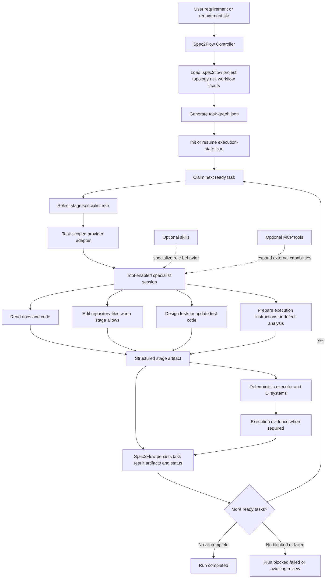
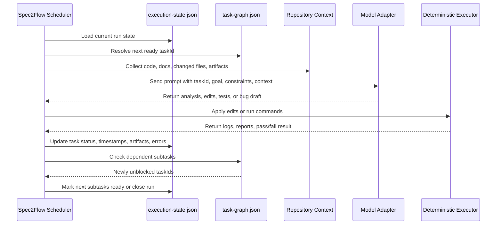

# Architecture Overview

- Status: active
- Source of truth: `AGENTS.md`, `packages/cli/src/planning/task-graph-service.ts`, `packages/cli/src/runtime/`, `packages/cli/src/adapters/`
- Verified with: `npm run build`, `npm run test:unit`

Spec2Flow is organized around a six-stage workflow implemented through five cooperating parts:

1. orchestration
2. adapter
3. agent workflow
4. execution
5. collaboration

The six stages explain what work happens. These five parts explain where each responsibility lives.

## Workflow Stages

1. Requirements analysis
2. Code implementation
3. Test design
4. Automated execution
5. Defect feedback
6. Collaboration workflow

## Runtime Orchestration Model

The six stages explain what work happens. The runtime orchestration model explains how a single development request is persisted and executed.

Core runtime objects:
- repository inputs stored in `.spec2flow/project.yaml`, `.spec2flow/topology.yaml`, `.spec2flow/policies/risk.yaml`, and workflow files such as `.spec2flow/workflows/smoke.yaml`
- one generated `task-graph.json` per planning pass
- one generated `execution-state.json` per workflow run
- execution artifacts stored under the configured execution output directory

Identity model:
- one user development request creates one workflow run identified by `runId`
- one workflow run contains many subtask nodes identified by stable `taskId`
- `taskId` is not the whole development request; it is one executable node inside that request
- all logs, validation results, bug drafts, and review handoffs should attach to `runId + taskId`

Typical `taskId` examples:
- `environment-preparation`
- `frontend-smoke--requirements-analysis`
- `frontend-smoke--code-implementation`
- `withdrawal-risk-regression--automated-execution`

Storage model:
- static configuration lives in repository files under `.spec2flow/`
- planning output is stored in `task-graph.json`
- runtime progress is stored in `execution-state.json`
- large evidence such as logs, screenshots, traces, and reports is stored in artifact directories and referenced back from `execution-state.json`

The relationship between the two generated files is:
- `task-graph.json` answers what should run
- `execution-state.json` answers what is running now and what already finished

## 1. Orchestration Layer
This layer is responsible for workflow control and persisted runtime state.

Responsibilities:
- load repository inputs and workflow definitions
- generate task graphs
- persist execution state
- claim ready tasks
- write task results and artifacts back into state

Primary runtime objects:
- `.spec2flow/project.yaml`
- `.spec2flow/topology.yaml`
- `.spec2flow/policies/risk.yaml`
- `task-graph.json`
- `execution-state.json`

## 2. Adapter Layer
This layer is responsible for mapping one claimed task into a provider-specific runtime.

Responsibilities:
- construct provider-specific prompts and permissions
- manage task-scoped agent sessions
- negotiate provider capabilities
- return one normalized task result payload

Primary contract files:
- `model-adapter-capability.json`
- `model-adapter-runtime.json`

## 3. Agent Workflow Layer
This layer is responsible for the stages where human intent and repository context need interpretation.

Responsibilities:
- analyze specs and repository context
- generate implementation tasks
- support code changes and reviews
- design test plans and test cases
- interpret failed runs
- draft bug reports

Primary tool:
- adapter-backed agent runtime

Primary outputs:
- requirement summaries
- implementation checklists
- test plans
- test cases
- bug drafts

## 4. Execution Layer
This layer is responsible for deterministic automation against a real or test environment.

Responsibilities:
- start services or test environments
- execute validation commands and Playwright tests when needed
- collect screenshots, traces, logs, and videos
- summarize execution output in a reusable format

Primary tools:
- repository-native command runner
- Playwright when browser coverage is needed

Primary outputs:
- execution reports
- artifacts
- pass/fail summaries

## 5. Collaboration Layer
This layer makes the workflow repeatable and reviewable across contributors.

Responsibilities:
- run validation in CI
- preserve execution artifacts
- create visibility through pull requests and issue updates
- route approved bug drafts into GitHub Issues
- keep implementation and validation history discoverable

Primary tools:
- GitHub Actions
- GitHub Issues

Primary outputs:
- CI runs
- artifact links
- issue records
- review history

## Design Principle

Spec2Flow should own orchestration and state.
Adapters should own task-scoped agent execution.
Deterministic executors should handle startup, validation, and evidence capture.
Collaboration tooling should keep the workflow reviewable and repeatable.

## Combined Architecture

The intended architecture combines two ideas that should reinforce each other rather than compete:

1. Spec2Flow controls workflow flow and persisted truth.
2. Specialist agents control professional division of labor inside one claimed task.

This means the target model is not:

- one global agent doing the whole workflow end to end
- six fixed long-lived agents handing work to each other through an opaque shared conversation

The target model is:

1. the controller owns intake, planning, claiming, state transitions, artifacts, retry and resume, and policy gates
2. the adapter selects a specialist role for the claimed `taskId`
3. the specialist agent executes only within that task boundary
4. the result is written back into `execution-state.json` as structured state and artifacts

So the overlay is:

- current architecture controls flow and truth
- multi-agent design controls specialization and permissions

## Controller Responsibilities

The controller must remain the system of record for:

- requirement intake
- route selection
- task graph generation
- execution-state persistence
- task claiming and status transitions
- artifact registration
- retry and resume logic
- policy gates between stages
- defect loop routing
- collaboration stop, retry, issue, and PR decisions

The controller must not delegate these responsibilities to model memory or to agent-to-agent chat.

## Specialist Agent Overlay

The specialist layer should be expressed as execution roles, not as free-floating autonomous sessions.

Recommended default roles:

1. `requirements-agent`
2. `implementation-agent`
3. `test-design-agent`
4. `execution-agent`
5. `defect-agent`
6. `collaboration-agent`

These roles should normally map to workflow stages through `executorType` and stage policy.

This means a stage is not only a status label. It is also an execution contract that defines:

- which specialist role should be used
- what repository access is allowed
- what deterministic commands may run
- what structured artifact should be produced
- what adapter-reported activity must be rejected before state is persisted when it violates role policy
- what adapter payload shape must pass schema validation before the controller accepts it

## Stage-to-Specialist Mapping

### Requirements Analysis

- default role: `requirements-agent`
- allowed behavior: read docs, read code, inspect topology, inspect prior artifacts
- forbidden behavior: silent code mutation, environment mutation, PR or issue side effects
- primary output: requirement summary artifact

### Code Implementation

- default role: `implementation-agent`
- allowed behavior: edit approved target files, update related docs, add minimal implementation notes
- forbidden behavior: unbounded repository rewrites, uncontrolled validation beyond policy
- primary output: code changes plus implementation summary artifact

### Test Design

- default role: `test-design-agent`
- allowed behavior: design or update test cases, test matrix, smoke scope, and test code where policy allows
- forbidden behavior: final authority on pass or fail outcomes
- primary output: test plan and test case artifacts

### Automated Execution

- default role: `execution-agent`
- allowed behavior: run approved commands, prepare execution-specific scaffolding, collect evidence
- forbidden behavior: inventing pass results without deterministic evidence
- primary output: execution report plus logs, traces, screenshots, and summaries

### Defect Feedback

- default role: `defect-agent`
- allowed behavior: analyze failed evidence, classify failure type, draft bug or repair guidance
- forbidden behavior: silently rewriting workflow history
- primary output: defect draft or repair summary artifact

### Collaboration Workflow

- default role: `collaboration-agent`
- allowed behavior: prepare PR handoff, summarize review status, prepare issue-ready output, request approval transitions
- forbidden behavior: bypassing policy gates for PR or issue creation
- primary output: collaboration handoff artifact

## Structured Handoff Model

The specialists should cooperate through structured task and artifact objects, not through a shared long-running conversation.

Each claimed task should have:

- `taskId`
- `stage`
- `goal`
- declared inputs
- declared target files
- declared verification commands
- risk level
- artifact directory

Each stage should write a stage-appropriate artifact that downstream tasks can consume.

Recommended artifact flow:

1. `requirements-analysis` writes a requirement summary
2. `code-implementation` writes an implementation summary or change receipt
3. `test-design` writes a test plan or test case set
4. `automated-execution` writes an execution report with evidence references
5. `defect-feedback` writes a defect draft or repair summary
6. `collaboration` writes a PR handoff or issue handoff artifact

This keeps downstream work auditable and resumable.

## Defect Loop Routing

The defect loop should not always return to requirements analysis.

The controller should route failures based on failure type:

1. requirement misunderstanding goes back to `requirements-analysis`
2. implementation defect goes back to `code-implementation`
3. missing or weak coverage goes back to `test-design`
4. environment or command failure goes back to `automated-execution`
5. review or release readiness issues go to `collaboration`

This avoids forcing every bug into the same linear loop.

For the normal execution-to-review path, the controller should also interpret stage artifacts:

1. if `automated-execution` finishes with a satisfied artifact contract, the controller may auto-skip `defect-feedback`
2. if `automated-execution` finishes with a missing artifact contract, the controller should route into `defect-feedback`
3. `collaboration` should not unlock until the routed defect path is either skipped or completed

## Session Strategy

Multi-agent design is primarily a specialization model, not a session-count model.

The recommended default remains:

- one session per `runId + routeName + executorType`

That gives each specialist enough continuity for one route and one responsibility without turning the entire workflow into one polluted session.

This means:

- requirements analysis continuity stays with `requirements-agent`
- implementation continuity stays with `implementation-agent`
- test design continuity stays with `test-design-agent`
- defect diagnosis continuity stays with `defect-agent`

But workflow truth still lives outside those sessions.

## Why This Overlay Is Better

Compared with a single generic agent, this overlay is better because:

1. permissions can be specialized by stage
2. outputs can be standardized by role
3. prompts and skills can be narrower and more stable
4. quality checks can be role-specific

Compared with a fixed linear chain of always-separate agents, this overlay is better because:

1. the controller still owns the DAG
2. retries and loopbacks are not hard-coded into one path
3. deterministic execution remains separate from agent narrative
4. the system can pause, resume, skip, or reroute without losing truth

## Related Docs

Use these files as the top-level navigation map:
- `README.md`: product overview and quick orientation
- `AGENTS.md`: repository rules, design principles, and doc maintenance rules
- `docs/structure.md`: current repository map and file responsibilities
- `docs/usage-guide.md`: adoption and runtime usage
- `docs/synapse-integration-automation-design.md`: complex-system integration guidance

## End-to-End Runtime Flow

When a user executes one development task, the runtime flow is:

1. input repository configuration and changed files
2. generate a task graph
3. initialize one execution state for the run
4. pick the next `ready` subtask
5. select the specialist role for that task stage
6. call the adapter-backed specialist with task context and repository context
7. apply deterministic execution where required
8. update execution state and unlock downstream subtasks
9. reroute failures through policy-driven defect loops when necessary
10. finish when all required subtasks are completed or stop when policy says the run must block

## Task and Subtask Semantics

One user-facing development request is a workflow run, not a single subtask row.

That means:
- the parent unit is `runId`
- the executable child units are `taskId`
- a route such as `frontend-smoke` expands into multiple subtasks across the six stages
- downstream subtasks unlock only after prerequisite subtasks are completed

So the execution rule is effectively:

1. create one run
2. expand it into subtasks
3. execute each subtask with the model or deterministic executor
4. validate each subtask
5. mark the parent run complete only when all required subtasks are completed

That is the correct mental model.

## Input and Persistence Points

Where input enters the system:
- repository modeling input comes from `.spec2flow/project.yaml`, `.spec2flow/topology.yaml`, `.spec2flow/policies/risk.yaml`, and workflow files
- change scope input comes from explicit changed-file lists or git diff
- execution commands come from the workflow definition and task graph
- model prompt input comes from `taskId`, repository code, documents, change scope, risk policy, and prior artifacts

Where runtime data is stored:
- onboarding and topology definitions stay in repository config files
- planning data is persisted in `task-graph.json`
- run progress is persisted in `execution-state.json`
- task evidence is stored in output folders and linked back through artifact references

## Program-to-Model Interaction

`init-execution-state` itself is deterministic. It does not need to call the model. Model interaction begins after the scheduler finds a `ready` task.

At that point the runtime should do the following:

1. load the current `execution-state.json`
2. select one `ready` `taskId`
3. gather prompt context using the task graph, repo files, docs, risk rules, and prior artifacts
4. send that context to the model adapter
5. receive structured output such as analysis, code edits, test plan, or bug draft
6. apply deterministic follow-up steps such as file edits or command execution
7. persist results back into `execution-state.json`

## External Adapter Boundary

The real provider integration point is an external adapter command, not a provider SDK embedded in the core CLI.

That boundary keeps Spec2Flow focused on:
- task selection
- state persistence
- dependency unlocking
- artifact and error bookkeeping

While the adapter command handles:
- prompt construction for a specific provider
- credentials and authentication
- provider-specific retries, streaming, or tool calling
- mapping provider output back into one normalized `adapterRun` payload

The bundled example adapter now uses GitHub Copilot CLI programmatic prompt mode through `gh copilot -p`. This follows the documented CLI path instead of relying on a private editor session protocol.

The adapter can now reuse Copilot CLI sessions through `--resume`, but session routing stays in the adapter layer rather than the controller layer.

The recommended routing is one session per `runId + routeName + executorType`. That preserves continuity for one specialist responsibility while keeping execution state, dependencies, artifacts, and failure handling outside the model session.

This means Spec2Flow does not assume one global chat for a workflow run, and it also does not require one fresh session per task. The adapter chooses the right middle ground based on provider behavior and the workflow's specialization boundaries.

GitHub Copilot Chat inside the IDE should still be treated as an interactive surface, not as the runtime backend for this controller loop. The runtime backend here is the documented Copilot CLI command surface.

The runtime contract is:

1. `claim-next-task` emits one task claim
2. `run-task-with-adapter` or `run-workflow-loop --adapter-runtime ...` executes the external command
3. the external command returns one structured result
4. Spec2Flow writes that result into `execution-state.json`

This keeps the controller/provider seam explicit and replaceable.

## CLI Runtime Mapping

The current CLI responsibilities are:
- `validate-onboarding`: validate repository onboarding inputs
- `generate-task-graph`: convert inputs plus requirement text or change scope into executable subtasks
- `init-execution-state`: expand every task graph node into runtime state for one run
- `update-execution-state`: persist subtask completion, attach artifacts, and unlock dependent subtasks
- `claim-next-task`: choose the next ready `taskId`, mark it in progress, and emit a model-facing task payload
- `submit-task-result`: persist the output of one claimed task and unlock downstream nodes
- `simulate-model-run`: emulate a provider adapter and validate the full claim-to-result loop
- `run-task-with-adapter`: execute one claimed task through an external provider adapter command
- `run-workflow-loop`: repeatedly claim and execute tasks until the run completes or reaches a configured step cap

This means the current implementation boundary is:
- Spec2Flow CLI now handles planning-state persistence, deterministic status transitions, task claiming, and task result write-back
- a provider adapter can now be any external command described by `model-adapter-runtime.json`
- `simulate-model-run` still exists to validate the loop without a provider dependency
- `run-workflow-loop` can now drive multiple subtasks either through simulation or through an external adapter command using the same persisted runtime contracts

## Stage-to-Tool Mapping

### Requirements Analysis
- primary tool: Copilot
- inputs: specs, design docs, repository context
- outputs: summaries, assumptions, task list

### Code Implementation
- primary tool: Copilot
- inputs: approved requirements and target modules
- outputs: code changes, implementation notes, PR summary

### Test Design
- primary tool: Copilot
- inputs: requirements, changed code, risk areas
- outputs: test plan, test cases, smoke scope

### Automated Execution
- primary tools: repository-native command runner and Playwright when browser coverage is needed
- inputs: runnable app, test cases, startup commands, validation commands
- outputs: run results, traces, screenshots, logs, test summaries

### Defect Feedback
- primary tools: Copilot and GitHub Issues
- inputs: failed execution reports and artifacts
- outputs: reviewable bug drafts and issue-ready content

### Collaboration Workflow
- primary tools: GitHub Actions and GitHub Issues
- inputs: pull requests, CI runs, approved bug drafts
- outputs: shared status, audit trail, triaged issues

## Can the Current Architecture Run Requirements to Tests

Yes, the current architecture can support the core chain:

1. requirements analysis
2. code implementation
3. test generation
4. test execution

But it only works if the responsibilities stay separated in the right place.

What Spec2Flow should own:
- requirement intake
- route selection
- task graph generation
- execution-state persistence
- dependency unlocking
- artifact bookkeeping
- policy gates between stages

What the external agent adapter should own:
- reading repository context for one claimed task
- selecting or loading the correct specialist profile for that claimed task
- deciding what files to edit for that task
- editing code when the stage allows write access
- generating tests when the stage is `test-design`
- invoking allowed validation commands when the stage is `automated-execution`
- returning one normalized structured result

What must stay outside the model session:
- workflow state
- task dependency graph
- task completion truth
- retry and resume logic
- artifact storage

That split is the reason the architecture is now viable. The earlier prompt-only design could analyze, but it could not reliably execute. The current adapter boundary supports a tool-enabled agent, so the model can act inside a constrained task while Spec2Flow remains the system of record.

In practical terms, the end-to-end flow should be:

1. `requirements-agent` handles `requirements-analysis` and emits a structured requirement summary
2. `implementation-agent` handles `code-implementation` and edits only the files needed for the claimed task
3. `test-design-agent` handles `test-design` and emits or updates unit, integration, or smoke tests based on changed risk areas
4. `execution-agent` handles `automated-execution` and runs canonical repository commands while storing evidence
5. `defect-agent` handles `defect-feedback` and converts failures into reviewable defect output
6. `collaboration-agent` handles `collaboration` and decides whether to stop, retry, open an issue, or prepare a PR handoff

This means the architecture is sufficient for the delivery loop, but only after three constraints are enforced:
- the adapter must have real file and shell tools, not prompt-only instructions
- stage permissions must be explicit, so requirements analysis cannot silently mutate code and collaboration cannot silently push changes
- deterministic executors must remain available for startup, validation, and evidence capture

## Agent, Skills, and MCP Boundaries

The clean boundary is:

- Spec2Flow is the orchestrator
- the provider adapter exposes one task-scoped agent runtime
- skills are optional execution guidance
- MCP is optional capability expansion

### Agent Integration

Agent integration is the minimum requirement for the core chain.

In the combined architecture, agent integration should be role-aware.

That means the adapter should not expose just one generic prompt shape. It should expose one task-scoped runtime with specialist overlays such as:

- requirements analysis profile
- implementation profile
- test design profile
- execution profile
- defect profile
- collaboration profile

If the agent can:
- read files
- write files
- run shell commands
- return structured output

then Spec2Flow can already orchestrate requirements, implementation, test generation, and test execution.

For the local repository workflow, this is enough for an MVP.

### Skills

Skills are not required to make the architecture work.

They become useful when you want stable, reusable behavior such as:
- a repository-specific requirements-analysis checklist
- a code review checklist
- a standard test-design rubric
- a bug report drafting format

So the right framing is:
- no, skills are not required for the controller architecture to function
- yes, skills are valuable once you want repeatable specialist behavior across repositories or teams

### MCP

MCP is also not required for the basic local development loop.

It becomes necessary when the workflow needs external systems that should not be reached through ad hoc shell commands, such as:
- GitHub PR creation and review APIs
- issue tracking systems
- design systems or documentation systems
- database inspection tools
- browser or environment services exposed as structured tools

So the right default is:
- local repo editing and test execution: agent plus task orchestration is enough
- cross-system automation and richer tool contracts: add MCP where it provides real leverage

## Should Task Splitting Use Copilot Plan

Copilot plan is useful, but it should not replace Spec2Flow task orchestration.

The better split is:

- Spec2Flow owns the persisted task graph
- Copilot plan helps a specialist agent think inside one claimed task

That means plan is good for:
- breaking one requirement-analysis claim into substeps
- outlining an implementation sequence before editing files
- drafting a test matrix before generating tests

Plan is not a good source of truth for:
- global dependency tracking
- resume and retry behavior
- cross-stage readiness
- auditability of the whole workflow run

So the recommendation is:

1. use Spec2Flow task graph as the outer DAG
2. allow the agent to use plan inside `requirements-analysis` and `code-implementation`
3. persist only the distilled deliverable, not the agent's entire internal planning transcript

This gives you the benefit of plan without giving up deterministic orchestration.

## Reference Architecture Diagram

## Recommended Operating Model

For the current implementation, the most defensible operating model is:

1. keep Spec2Flow focused on workflow orchestration and persisted state
2. keep stage-to-role mapping explicit through `executorType` and stage policy
3. keep one tool-enabled specialist session per `runId + routeName + executorType`
4. allow stage-specific write and shell permissions through the adapter runtime
5. use repository-native validation commands as the default execution layer
6. route defect loops by failure class instead of always returning to requirements analysis
7. add Playwright only where browser validation is actually required
8. add skills after the core loop is stable
9. add MCP only for external systems that need structured, governed access

This keeps the architecture narrow enough to work now, while still leaving room for richer multi-agent and multi-provider expansion later.