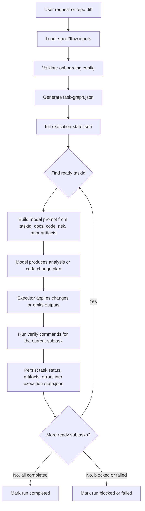
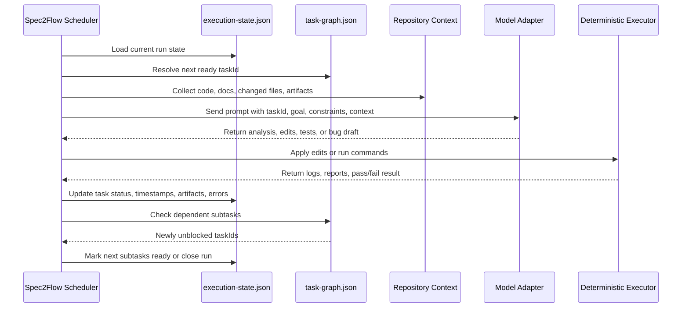

# Architecture Overview

Spec2Flow is organized around a six-stage workflow implemented through three cooperating layers and one runtime orchestration model.

## Workflow Stages

1. Requirements analysis
2. Code implementation
3. Test design
4. Automated execution
5. Defect feedback
6. Collaboration workflow

## Runtime Orchestration Model

The six stages explain what work happens. The runtime orchestration model explains how a single development request is persisted and executed.

Core runtime objects:
- repository inputs stored in `.spec2flow/project.yaml`, `.spec2flow/topology.yaml`, `.spec2flow/policies/risk.yaml`, and workflow files such as `.spec2flow/workflows/smoke.yaml`
- one generated `task-graph.json` per planning pass
- one generated `execution-state.json` per workflow run
- execution artifacts stored under the configured execution output directory

Identity model:
- one user development request creates one workflow run identified by `runId`
- one workflow run contains many subtask nodes identified by stable `taskId`
- `taskId` is not the whole development request; it is one executable node inside that request
- all logs, validation results, bug drafts, and review handoffs should attach to `runId + taskId`

Typical `taskId` examples:
- `environment-preparation`
- `frontend-smoke--requirements-analysis`
- `frontend-smoke--code-implementation`
- `withdrawal-risk-regression--automated-execution`

Storage model:
- static configuration lives in repository files under `.spec2flow/`
- planning output is stored in `task-graph.json`
- runtime progress is stored in `execution-state.json`
- large evidence such as logs, screenshots, traces, and reports is stored in artifact directories and referenced back from `execution-state.json`

The relationship between the two generated files is:
- `task-graph.json` answers what should run
- `execution-state.json` answers what is running now and what already finished

## 1. Copilot Workflow Layer
This layer is responsible for the stages where human intent and repository context need interpretation.

Responsibilities:
- analyze specs and repository context
- generate implementation tasks
- support code changes and reviews
- design test plans and test cases
- interpret failed runs
- draft bug reports

Primary tool:
- Copilot

Primary outputs:
- requirement summaries
- implementation checklists
- test plans
- test cases
- bug drafts

## 2. Execution Layer
This layer is responsible for deterministic automation against a real or test environment.

Responsibilities:
- start services or test environments
- execute Playwright tests
- collect screenshots, traces, logs, and videos
- summarize execution output in a reusable format

Primary tool:
- Playwright

Primary outputs:
- execution reports
- artifacts
- pass/fail summaries

## 3. Collaboration Layer
This layer makes the workflow repeatable and reviewable across contributors.

Responsibilities:
- run validation in CI
- preserve execution artifacts
- create visibility through pull requests and issue updates
- route approved bug drafts into GitHub Issues
- keep implementation and validation history discoverable

Primary tools:
- GitHub Actions
- GitHub Issues

Primary outputs:
- CI runs
- artifact links
- issue records
- review history

## Design Principle

Copilot should decide what needs to change and what needs to be tested.
Playwright should deterministically handle how flows are executed.
GitHub Actions and GitHub Issues should ensure the process is reviewable, repeatable, and collaborative.

## End-to-End Runtime Flow

When a user executes one development task, the runtime flow is:

1. input repository configuration and changed files
2. generate a task graph
3. initialize one execution state for the run
4. pick the next `ready` subtask
5. call the model with task context and repository context
6. apply changes or produce task output
7. run validation commands for that subtask
8. update execution state and unlock downstream subtasks
9. finish when all subtasks are completed or fail the run if a required subtask fails

## Task and Subtask Semantics

One user-facing development request is a workflow run, not a single subtask row.

That means:
- the parent unit is `runId`
- the executable child units are `taskId`
- a route such as `frontend-smoke` expands into multiple subtasks across the six stages
- downstream subtasks unlock only after prerequisite subtasks are completed

So the execution rule is effectively:

1. create one run
2. expand it into subtasks
3. execute each subtask with the model or deterministic executor
4. validate each subtask
5. mark the parent run complete only when all required subtasks are completed

That is the correct mental model.

## Input and Persistence Points

Where input enters the system:
- repository modeling input comes from `.spec2flow/project.yaml`, `.spec2flow/topology.yaml`, `.spec2flow/policies/risk.yaml`, and workflow files
- change scope input comes from explicit changed-file lists or git diff
- execution commands come from the workflow definition and task graph
- model prompt input comes from `taskId`, repository code, documents, change scope, risk policy, and prior artifacts

Where runtime data is stored:
- onboarding and topology definitions stay in repository config files
- planning data is persisted in `task-graph.json`
- run progress is persisted in `execution-state.json`
- task evidence is stored in output folders and linked back through artifact references

## Program-to-Model Interaction

`init-execution-state` itself is deterministic. It does not need to call the model. Model interaction begins after the scheduler finds a `ready` task.

At that point the runtime should do the following:

1. load the current `execution-state.json`
2. select one `ready` `taskId`
3. gather prompt context using the task graph, repo files, docs, risk rules, and prior artifacts
4. send that context to the model adapter
5. receive structured output such as analysis, code edits, test plan, or bug draft
6. apply deterministic follow-up steps such as file edits or command execution
7. persist results back into `execution-state.json`

## External Adapter Boundary

The real provider integration point is an external adapter command, not a provider SDK embedded in the core CLI.

That boundary keeps Spec2Flow focused on:
- task selection
- state persistence
- dependency unlocking
- artifact and error bookkeeping

While the adapter command handles:
- prompt construction for a specific provider
- credentials and authentication
- provider-specific retries, streaming, or tool calling
- mapping provider output back into one normalized `adapterRun` payload

The bundled example adapter now uses GitHub Copilot CLI programmatic prompt mode through `gh copilot -p`. This follows the documented CLI path instead of relying on a private editor session protocol.

The adapter runs one focused Copilot CLI session per `taskId`, which aligns with the Copilot CLI guidance to keep sessions focused and use explicit plans/prompts for non-trivial work.

GitHub Copilot Chat inside the IDE should still be treated as an interactive surface, not as the runtime backend for this controller loop. The runtime backend here is the documented Copilot CLI command surface.

The runtime contract is:

1. `claim-next-task` emits one task claim
2. `run-task-with-adapter` or `run-workflow-loop --adapter-runtime ...` executes the external command
3. the external command returns one structured result
4. Spec2Flow writes that result into `execution-state.json`

This keeps the controller/provider seam explicit and replaceable.

## CLI Runtime Mapping

The current CLI responsibilities are:
- `validate-onboarding`: validate repository onboarding inputs
- `generate-task-graph`: convert inputs plus change scope into executable subtasks
- `init-execution-state`: expand every task graph node into runtime state for one run
- `update-execution-state`: persist subtask completion, attach artifacts, and unlock dependent subtasks
- `claim-next-task`: choose the next ready `taskId`, mark it in progress, and emit a model-facing task payload
- `submit-task-result`: persist the output of one claimed task and unlock downstream nodes
- `simulate-model-run`: emulate a provider adapter and validate the full claim-to-result loop
- `run-task-with-adapter`: execute one claimed task through an external provider adapter command
- `run-workflow-loop`: repeatedly claim and execute tasks until the run completes or reaches a configured step cap

This means the current implementation boundary is:
- Spec2Flow CLI now handles planning-state persistence, deterministic status transitions, task claiming, and task result write-back
- a provider adapter can now be any external command described by `model-adapter-runtime.json`
- `simulate-model-run` still exists to validate the loop without a provider dependency
- `run-workflow-loop` can now drive multiple subtasks either through simulation or through an external adapter command using the same persisted runtime contracts

## Stage-to-Tool Mapping

### Requirements Analysis
- primary tool: Copilot
- inputs: specs, design docs, repository context
- outputs: summaries, assumptions, task list

### Code Implementation
- primary tool: Copilot
- inputs: approved requirements and target modules
- outputs: code changes, implementation notes, PR summary

### Test Design
- primary tool: Copilot
- inputs: requirements, changed code, risk areas
- outputs: test plan, test cases, smoke scope

### Automated Execution
- primary tool: Playwright
- inputs: runnable app, test cases, startup commands
- outputs: run results, traces, screenshots, logs

### Defect Feedback
- primary tools: Copilot and GitHub Issues
- inputs: failed execution reports and artifacts
- outputs: reviewable bug drafts and issue-ready content

### Collaboration Workflow
- primary tools: GitHub Actions and GitHub Issues
- inputs: pull requests, CI runs, approved bug drafts
- outputs: shared status, audit trail, triaged issues