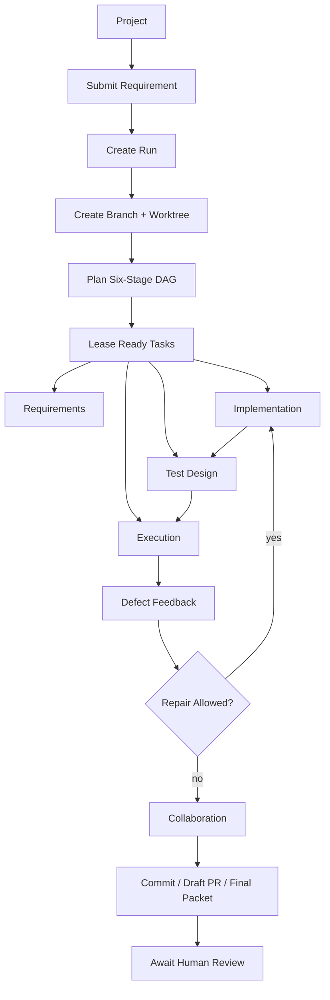

# Project Workspace Autonomous Delivery Design

- Status: active
- Source of truth: `docs/agent-orchestration-platform-design.md`, `docs/architecture.md`, `docs/object-store-local-first-design.md`, `packages/cli/src/planning/task-graph-service.ts`, `packages/cli/src/platform/platform-control-plane-run-submission-service.ts`, `packages/cli/src/platform/platform-scheduler-service.ts`, `packages/cli/src/runtime/task-result-service.ts`, `packages/cli/src/runtime/collaboration-publication-service.ts`
- Verified with: `npm run build`, `npm run test:unit`, `npm run validate:docs`
- Last verified: 2026-03-26

## Goal

Define the V1 product shape for Spec2Flow as a locally deployed control plane that can:

1. bind one project to one controlled workspace
2. accept one feature request
3. decompose the request into multiple independent task plans before expanding them into the six-stage DAG
4. execute the full six-stage loop with minimal human intervention and a path toward unattended autonomous closure
5. auto-repair bounded failures
6. finish on a review-ready branch with evidence and a final delivery packet
7. evolve toward true no-human-mid-loop operation through explicit evaluators and project-level adapter capability profiles

This document answers a narrower question than the broader platform design:

What must change so Spec2Flow behaves like a project-scoped autonomous delivery system rather than only a task scheduler?

## Decision Summary

The current platform direction is correct, but the product still needs one more architectural layer above runs and tasks:

- `Project` becomes the operator-facing root object
- `Workspace` becomes a first-class execution boundary
- each user request becomes one `Run`
- each run gets its own `Branch` and preferably its own `Worktree`
- the six-stage loop remains stable
- auto-repair remains policy-bounded
- completion means "review-ready delivery package exists", not merely "all tasks stopped changing state"

The current repository already has the controller, task graph, scheduler, worker entrypoints, auto-repair, execution hardening, and collaboration publish primitives. What is still missing is a stronger product model for project/workspace ownership and a stricter run lifecycle that guarantees isolated autonomous delivery.

## Product Promise

The target V1 user experience is:

1. register a project once
2. define its allowed workspace
3. submit one feature request
4. let Spec2Flow create a run, split tasks, create a working branch, execute the loop, fix bounded defects, and publish a review-ready result
5. let a human review the outcome at the end

Human review remains the last gate. Human orchestration should not be required in the middle of a healthy run.

The longer-term system target is stronger than V1:

- no-human-mid-loop orchestration for healthy low-risk runs
- autonomous requirement-to-multi-task planning before DAG generation
- evaluator-owned completion decisions instead of implementation-agent self-approval
- project-level adapter profiles so AI runtime capability is part of project registration, not late file discovery

## Why The Current Design Is Not Yet Enough

The current design already covers:

- six-stage DAG decomposition
- durable PostgreSQL-backed run and task state
- lease and heartbeat scheduler primitives
- stage-scoped workers
- deterministic execution and evidence capture
- bounded auto-repair
- branch and commit publication primitives

But the current product shape still leaves too much implicit:

- `repositoryRootPath` is doing the job of a missing project model
- workspace boundaries are not yet a first-class policy object
- requirement decomposition is still too close to route selection and lacks a first-class task-plan layer
- branch creation exists, but run isolation is not yet defined as a required lifecycle contract
- completion is still too close to task state and not yet tied to evaluator-owned acceptance plus a final delivery packet
- project AI capability is still discovered too late instead of being owned by the project profile
- worker orchestration is still CLI-harness oriented rather than a long-running autonomous service model

## Core Domain Model

### Project

`Project` is the top-level operator object.

It should own:

- project identity and display name
- repository root path
- workspace root path
- onboarding config paths
- default branch
- branch naming policy
- artifact storage policy
- execution runtime profile
- risk and approval policy

Recommended minimum fields:

```json
{
  "projectId": "spec2flow",
  "name": "Spec2Flow",
  "repositoryRootPath": "/workspace/Spec2Flow",
  "workspaceRootPath": "/workspace/Spec2Flow",
  "defaultBranch": "main",
  "branchPrefix": "spec2flow/",
  "projectPath": ".spec2flow/project.yaml",
  "topologyPath": ".spec2flow/topology.yaml",
  "riskPath": ".spec2flow/policies/risk.yaml",
  "artifactStoreProfile": "local-default",
  "executionProfile": "local-agent",
  "workspacePolicy": {
    "allowedReadGlobs": ["**/*"],
    "allowedWriteGlobs": ["src/**", "tests/**", "docs/**", ".spec2flow/**"],
    "forbiddenWriteGlobs": [".git/**", "node_modules/**", "dist/**"]
  }
}
```

### Workspace

`Workspace` is the concrete read and write boundary for agents and deterministic execution.

In V1, one project can map to one local workspace root. The important rule is that the workspace boundary must be explicit and enforced in both:

- agent claim payloads
- deterministic execution and artifact resolution

The product promise is not "agents can read the repository." The product promise is "agents can read only the project workspace they were granted."

### Run

`Run` remains the execution object created from one user request.

Each run should bind:

- one project
- one requirement or change request
- one branch
- one worktree path
- one DAG of six-stage tasks
- one review package outcome

### Task

`Task` stays stage-scoped and route-scoped. The current six-stage model should not change:

1. requirements analysis
2. code implementation
3. test design
4. automated execution
5. defect feedback
6. collaboration workflow

`environment-preparation` remains a controller-owned preflight helper, not the main product headline.

## Run Isolation Contract

This is the most important product upgrade.

Each accepted request should create:

1. one branch
2. one worktree rooted under a managed Spec2Flow workspace area
3. one run bound to that worktree

Recommended V1 default:

- branch: `spec2flow/<run-id>-<slug>`
- worktree root: `.spec2flow/worktrees/<run-id>/`

Why this matters:

- parallel feature requests do not corrupt one another
- auto-repair loops stay inside the run boundary
- deterministic execution runs against the same isolated tree the implementation worker edited
- final review becomes simpler because every run maps to one isolated branch and one evidence set

Using only one mutable repository root for all runs is a future architecture alarm. V1 should prefer worktree isolation by default.

## Autonomous Delivery Lifecycle



## Required V1 Flow

### 1. Project Registration

Before any autonomous run, an operator registers a project and its workspace policy.

V1 should support local registration through config or control-plane forms. This does not require multi-tenant auth yet.

### 2. Requirement Intake

The user submits:

- project
- feature request text or requirement file
- optional changed-file hints
- optional execution mode override

The product should normalize that into one run request and store the raw request as evidence.

### 3. Planning

The existing planner remains the right engine, but it needs one more layer:

- decompose the requirement into explicit task plans
- map each task plan onto one or more routes
- build stage-scoped subtasks from those task plans
- attach target files, verify commands, and specialist roles
- persist the DAG

V1.1 should treat `taskPlans` as first-class planning artifacts. They are the bridge between raw requirement text and the six-stage DAG. Without that bridge, the system is still a route expander, not an autonomous delivery planner.

The first safe scheduling policy for task plans should be conservative:

- infer task-plan dependencies from declared service dependencies in project and topology config
- allow independent task plans to run in parallel
- hold dependent task plans until upstream task plans finish collaboration handoff

This is intentionally stricter than the final target scheduler. It gives the control plane a deterministic dependency spine before introducing plan-level parallel repair, evaluator feedback, or dynamic replanning.

The planner should now also resolve workspace-scoped file permissions from the project profile.

### 4. Branch And Worktree Provisioning

Before the first mutable task runs:

- create the branch from the project's default branch
- create the worktree
- materialize the run-scoped workspace path
- bind all later workers to that worktree

This is the boundary that makes "autonomous implementation" safe enough for V1.

### 5. Worker Execution

Workers continue to operate stage by stage.

The new rule is:

- every worker receives the run worktree path, not only the repository root
- every worker receives workspace read and write policy
- every worker must treat worktree-local state as canonical for that run

### 6. Auto-Repair

The repair loop stays policy-bounded:

- execution failure routes to defect feedback
- defect feedback classifies the failure
- controller decides repair target stage
- owning stage is requeued when policy allows
- downstream tasks are invalidated and rerun
- escalation stops the loop when budget is exhausted

This is already directionally implemented. The product upgrade is to make the repair loop part of the run lifecycle contract, not an internal implementation detail.

### 7. Collaboration And Delivery

When all repairable work is complete:

- collaboration writes the final handoff
- publication creates or updates the run branch
- commit is created under policy
- optional PR draft is generated
- final delivery packet is assembled
- run transitions to `awaiting-review`

The run should not be considered truly finished until this packet exists.

## Definition Of Done

A run is `completed` only when all of the following are true:

- all required tasks are in terminal success states
- no task is still leased or in progress
- no repair attempt is still open
- all required artifacts exist
- execution evidence is indexed
- collaboration handoff exists
- publication record exists
- a branch and commit exist, or the run is explicitly configured for handoff-only delivery
- a final delivery packet exists for human review

This is stricter than "all tasks say completed" and that is intentional.

## Final Delivery Packet

The final delivery packet should be a first-class artifact produced at the end of the run.

Recommended contents:

- run summary
- requirement summary
- implementation summary
- changed files
- test plan summary
- execution result summary
- defect and repair history
- publication status
- branch name
- commit sha
- important artifact links
- unresolved risks or manual follow-up items

This packet is the human review surface for V1.

## Required Policy Controls

The existing risk and repair policy should be extended or interpreted through the project model.

Required V1 policy controls:

- `maxAutoRepairAttempts`
- `maxExecutionRetries`
- `allowAutoCommit`
- `requireHumanApproval`
- `blockedRiskLevels`
- `workspacePolicy`
- `publicationMode`
- `runIsolationMode`

Recommended V1 defaults:

- auto-commit allowed only for low and medium risk
- final review always required before merge
- worktree isolation enabled by default
- local artifact storage enabled by default

## What Must Change In The Current Architecture

### Add First-Class Project Storage

Need:

- `projects` table
- `project_workspace_policies`
- `project_runtime_profiles`

The current run submission path should stop treating `repositoryRootPath` as the only root object.

### Add Run Provisioning Service

Need a service that owns:

- branch naming
- branch creation
- worktree provisioning
- worktree cleanup policy
- run-to-worktree binding persistence

This should sit between intake and worker execution.

### Add Workspace-Bound Claim Contract

Every worker claim should include:

- project id
- repository root path
- run worktree path
- allowed read globs
- allowed write globs
- forbidden write globs

That contract should be visible to both adapter-backed workers and deterministic execution.

### Add Final Delivery Artifact

Need a controller-owned artifact such as `delivery-review-packet`.

This should become the final operator-facing output of a successful autonomous run.

### Upgrade Collaboration Completion Semantics

The current collaboration publish flow already creates branch and commit records. It should additionally become the place where the run is closed into:

- `awaiting-review`
- or `completed` when the selected delivery mode is handoff-only and the packet is ready

## V1 And V2 Boundary

### V1

V1 should target:

- local deployment
- local projects
- one workspace per project
- one branch and worktree per run
- one human review at the end
- no multi-tenant auth requirement
- no cloud object storage requirement

This is enough to ship a strong autonomous local engineering product.

### V2

V2 can extend the same model into:

- multi-tenant projects
- operator and reviewer roles
- permissions and audit policy
- remote object storage
- remote push and PR API integrations
- distributed long-running worker fleets

V2 should extend the V1 model, not replace it.

## Non-Goals For V1

V1 should not require:

- merge automation into protected main branches
- cross-tenant access controls
- distributed cloud worker orchestration
- full enterprise RBAC
- mandatory object-store infrastructure

Those are valid V2 concerns, but they should not delay the local autonomous product.

## Implementation Priority

The next architecture moves should happen in this order:

1. add the project and workspace data model
2. add branch and worktree provisioning
3. bind all worker claims to run worktrees
4. add final delivery packet generation
5. upgrade the run lifecycle to end at `awaiting-review`
6. only then deepen Phase 7 and later Phase 8 or V2 concerns

## Acceptance Test For The Product Promise

Spec2Flow should be considered aligned with this design only when the following end-to-end path works:

1. register one local project with one workspace policy
2. submit one feature request
3. Spec2Flow creates a run, branch, and worktree
4. Spec2Flow plans the six-stage DAG
5. workers complete requirements, implementation, test design, execution, defect handling, and collaboration without human intervention
6. bounded defects trigger automatic repair and rerun
7. the run ends with a branch, commit, evidence, and delivery-review packet
8. a human can review that packet and decide whether to merge

If any of those steps still require a human operator to babysit the controller, the product is not yet at the intended V1 shape.
