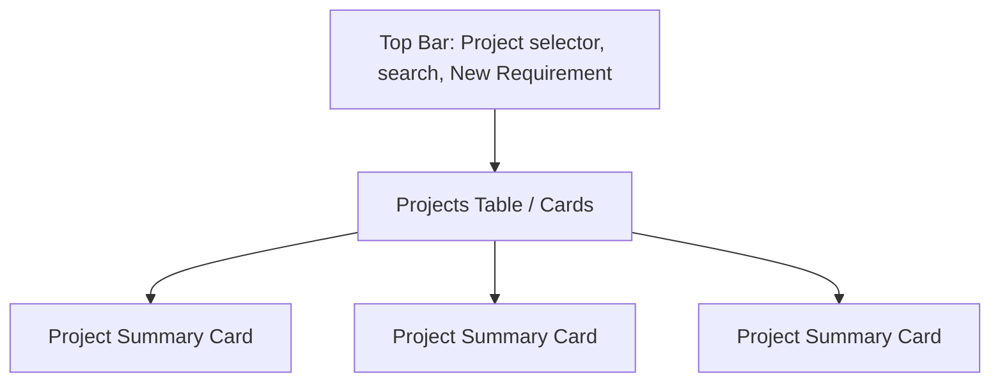
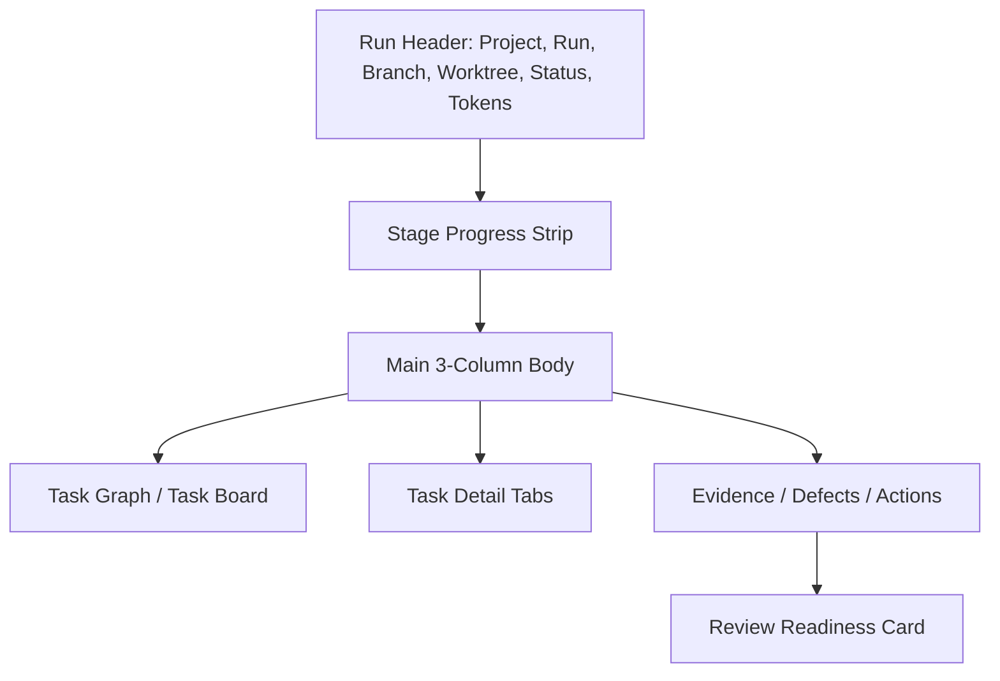

# Web Control Plane Product Design

- Status: active
- Source of truth: `docs/project-workspace-autonomous-delivery-design.md`, `docs/agent-orchestration-platform-design.md`, `docs/plans/web-control-plane-frontend-implementation.md`, `packages/cli/src/platform/platform-control-plane-server.ts`, `packages/web/src/components/projects/run-session-panel.tsx`, `packages/web/src/components/projects/stage-result-panel.tsx`, `packages/web/src/pages/control-plane-run-detail-page.tsx`
- Verified with: `npm run validate:docs`, `npm run web:build`
- Last verified: 2026-03-26

## Goal

Define the operator-facing product UI for Spec2Flow as a local-first autonomous delivery control plane.

Companion docs:

- visual language: [docs/ui/visual-language.md](/Users/cliff/workspace/Spec2Flow/docs/ui/visual-language.md)
- UI docs map: [docs/ui/index.md](/Users/cliff/workspace/Spec2Flow/docs/ui/index.md)
- exploration assets: [docs/ui/reference/README.md](/Users/cliff/workspace/Spec2Flow/docs/ui/reference/README.md)

This document answers one product question:

How should the UI look and behave if Spec2Flow is meant to take one project, accept one feature request, split the work, run the six-stage loop automatically, repair bounded defects, and only ask a human to review the final result?

## Short Answer

Yes. UI design should happen now.

The reason is not branding. The reason is product structure.

Spec2Flow is no longer only a run list plus task debug console. It is becoming a `project -> workspace -> run -> task -> evidence -> review packet` product. If the UI is not designed around that object model first, the frontend will drift into a pile of disconnected admin panels.

## Product Promise

The UI must make one promise clear:

1. the user registers a project once
2. the user submits one feature request against that project
3. Spec2Flow does the planning, implementation, test design, execution, defect repair, and collaboration flow automatically
4. the user mostly monitors progress
5. the user only needs to validate the final outcome and evidence

The UI is therefore not a manual orchestration surface.
It is a monitor-first, evidence-first, review-ready delivery console.

## Core UI Principles

- project-first, not run-first
- one primary action: submit a new requirement against a project
- progressive disclosure: summary first, evidence second, raw detail last
- operator confidence over visual noise
- every visible state must map to backend truth, not frontend inference
- evidence and code deltas matter more than decorative charts
- approval and intervention controls stay available, but not visually dominant during healthy runs
- final human sign-off must render as an explicit review decision state, not as leaked backend status jargon

## Information Architecture

The product should stabilize around five operator views:

1. Projects
2. Project Detail
3. New Requirement / Run Intake
4. Run Detail
5. Review Packet

The UI may still use drawers, tabs, and side panels, but the operator mental model should stay this simple.

The supporting `/runs` surface is not a passive history page.
It must open with an attention-first deck that answers one operator question immediately: which runs need intervention now, and what is the next action.

Review packet contract:

- if a collaboration handoff is waiting on human approval, the review packet must surface `Accept Result` and `Needs Follow-up` as first-class controls
- once a reviewer acts, the packet must render a durable decision state such as `accepted`, `follow-up required`, or `awaiting decision`
- final review actions should collect a structured operator note so the acceptance or follow-up rationale is auditable without reopening raw event payloads
- project-level monitoring surfaces should reuse that same final review rationale so operators can spot accepted vs follow-up-required runs without drilling back into the packet first
- primary review packet copy should stay human-facing; raw backend values like `approval-required` or `published` are supporting evidence, not the final-signoff headline

## App Shell

The global app shell should have:

- left navigation rail
- top command bar
- main content area
- optional right-side contextual drawer

Recommended left rail:

- `Projects`
- `Runs`
- `Attention`
- `Artifacts`
- `Settings`

Recommended top command bar:

- active project selector
- global search
- `New Requirement` primary button
- system health badge

Global queue requirement:

- the `/runs` surface must render an attention deck above the full queue
- each attention card must compress one run into headline, blocker detail, and next action
- when a final review decision exists, the `/runs` attention deck should surface that decision and its operator rationale directly instead of collapsing everything back to generic `review-ready` copy
- the full queue remains available below as the audit and navigation list

Recommended right drawer usage:

- task detail
- defect detail
- artifact preview
- approval action summary

## Primary Pages

### 1. Projects Page

This is the real homepage in V1.

The user should immediately see:

- all registered projects
- project health
- active run count
- blocked run count
- last completed run
- workspace policy summary
- default branch and artifact store mode

Recommended layout:

- header with `Projects` title and `Register Project` action
- project cards or dense table as the main body
- each project row opens project detail

Each project card should show:

- project name
- repository root
- workspace root
- default branch
- branch prefix
- active runs
- blocked runs
- last run updated time

### 2. Project Detail Page

This is the project command center.

It should answer:

- what this project is allowed to touch
- what run is currently active
- what recent requirements were submitted
- whether the system is healthy enough to accept a new run

Recommended sections:

- `Overview`
- `Runs`
- `Workspace Policy`
- `Routes and Runtime`
- `Delivery History`

Overview should show:

- project metadata
- workspace boundaries
- default branch
- artifact storage mode
- runtime profile
- risk policy summary

Runs section should show:

- active runs
- completed runs
- blocked runs
- quick filter by status and stage

Workspace Policy section should show:

- allowed read globs
- allowed write globs
- forbidden write globs
- worktree mode
- current worktree root

### 3. New Requirement / Run Intake

This should be launched from a project context, not as a free-floating raw form.

Recommended interaction:

- `New Requirement` opens a modal or a focused page
- the project is preselected
- the user only fills requirement data and optional hints

Required form fields:

- project
- requirement title
- requirement text or requirement file
- optional changed files
- optional priority
- optional notes

Advanced section:

- branch override
- execution mode override
- worktree mode override
- model/runtime override

Submission result should immediately show:

- created run id
- branch name
- worktree path
- planned task count
- selected routes

### 4. Run Detail Page

This is the most important page in the whole product.

It should let the operator understand one autonomous delivery run without reading raw JSON.

The page should be divided into six information bands:

1. run summary
2. stage progress
3. task graph and task list
4. evidence and code changes
5. defects and repair history
6. final review readiness

Recommended top summary strip:

- run id
- project
- branch
- worktree
- current stage
- run status
- started time
- latest event time
- token usage
- approval state

Run detail must also expose a handoff-readiness decision, not only raw state.

Required run-level decision signals:

- autonomy score derived from observable delivery health, evidence completeness, and unresolved gates
- handoff readiness state: `review-ready`, `attention-required`, `blocked`, or `in-flight`
- next action explaining whether the operator should review, approve, inspect a repair path, or simply keep monitoring

Required run-level operator behavior:

- the `Next Action` judgment must render a real control or navigation CTA, not only text
- pending publication approval must expose `Approve Publication` and `Reject Publication` directly from run detail and review packet
- blocked repair or blocked task states must expose a direct retry control from run detail and review packet
- missing-evidence states must deep-link the operator to the evidence section instead of forcing manual scanning
- healthy completed runs must expose a direct `Open Review Packet` CTA from the run summary band

Recommended stage progress strip:

- requirements analysis
- code implementation
- test design
- automated execution
- defect feedback
- collaboration

Each stage should show:

- status
- owning task count
- latest updated time
- whether blocked

Run detail and project-session surfaces must use the stage strip as a top tab bar, not as a passive decoration.

Required behavior:

- the current stage is selected by default and visibly highlighted
- clicking any stage switches the lower execution view to that stage only
- the lower execution view shows that stage's timeline, task activity, artifacts, and block/completion outcome
- the stage strip remains the primary state-machine navigation for the six-stage pipeline
- the event log inside the selected stage must be rendered in chronological order from top to bottom

The selected-stage session surface must expose both process data and result data.

Required data sources for each stage view:

- process data: leased, started, completed, blocked, retry, approval, and artifact-attached events from platform observability
- result data: task summaries, task status, expected-vs-produced artifact counts, and stage artifacts returned by run detail
- selected-stage artifacts must support inline preview for text and JSON outputs so operators can inspect the actual agent result without leaving the session surface
- the selected-stage result surface must expose the autonomy loop state for that stage: repair attempts, approval gates, and collaboration publication status when those flows exist
- the selected-stage result surface must also compress the autonomy loop into operator-facing command signals: self-heal recovery rate, current blocker, and next automatic action
- when defect-closure signals exist, the stage surface must render a single chronological closure timeline that merges defect discovery, repair, approval, and publication recovery into one visible path
- requirement and planning stages must not appear blank merely because recent-event windows excluded their older timeline entries; the UI must still render task goals and generated artifacts for that stage

Do not collapse all six stages into one mixed conversation stream.
The mixed stream is useful only as a supporting audit view, not as the primary operator navigation model.

Recommended main body layout:

- left: DAG or stage-grouped task board
- center: selected task detail
- right: evidence / defects / operator actions

### 5. Review Packet Page

This is the human handoff page.

The user should not need to click through six separate panels to decide whether the run succeeded.

This page should show:

- final requirement summary
- implemented files
- tests added or changed
- execution result summary
- open or resolved defects
- repair attempts
- final branch and commit
- publication status
- links to artifacts

Primary actions:

- `Accept Result`
- `Needs Follow-up`
- `Open Branch`
- `Open Evidence`

The first review-packet implementation must live on a dedicated route under the run, so the operator can move from run detail into one approval-grade summary surface without reconstructing the story from six panels.

The first review-packet implementation must also make `Open Branch` and `Open Evidence` real links backed by run data, not placeholder buttons.

The review packet must also reuse the same derived operator CTA model as run detail, so approval, retry, and evidence-inspection actions remain executable from the final handoff surface.

## Task Detail Design

Task detail must be rich.
This is where the product either feels like an engineering control plane or collapses into status spam.

For a selected task, the operator should see:

- task title
- stage
- status
- goal
- dependencies
- owning route
- attempt count
- retry count
- auto-repair count
- worker id when leased or in progress
- token usage
- target files
- verify commands

Task detail tabs should be:

- `Summary`
- `Artifacts`
- `Code`
- `Tests`
- `Defects`
- `Events`
- `Tokens`

### Summary Tab

Shows:

- generated requirement summary or implementation summary
- subtask list
- current state
- missing deliverables

### Artifacts Tab

Shows:

- requirement-analysis document
- implementation summary
- test plan
- test cases
- execution report
- defect summary
- collaboration handoff
- final review packet

### Code Tab

Shows:

- changed files
- per-task diff summary
- linked commit when available
- files changed during repair

This tab should not try to become a full IDE.
It should provide diff summaries and file-level drill-down, not replace Git tools.

### Tests Tab

Shows:

- generated test cases
- mapped verify commands
- execution result per test
- pass/fail/skipped status
- flaky or repeated-failure notes

### Defects Tab

Shows:

- defects created by this task or against this task
- failure class
- recommended action
- repair attempts
- escalation state
- code changed by each repair attempt

### Events Tab

Shows:

- task lease
- task start
- heartbeat anomalies
- artifact writes
- retry
- approval
- publication

### Tokens Tab

Shows:

- prompt tokens
- completion tokens
- total tokens
- estimated cost
- by attempt
- by repair attempt
- by stage aggregate

This requires explicit backend support. The UI should be designed for it now even if V1 starts with partial data.

## Project And Run Navigation Model

The navigation path should be:

`Projects -> Project Detail -> New Requirement -> Run Detail -> Review Packet`

Not:

`Runs -> random row -> another panel -> another panel -> another panel`

Runs remain important, but they should feel subordinate to projects.

## Page Layout Wireframes

### Projects Page



### Run Detail Page



## Functional Modules

The frontend should be split by product responsibility, not by whatever page happened to exist first.

Recommended modules:

- `project-registry`
- `project-detail`
- `requirement-intake`
- `run-overview`
- `run-stage-progress`
- `task-board`
- `task-detail`
- `artifact-browser`
- `defect-repair`
- `review-packet`
- `usage-and-token-metrics`

Recommended shared primitives:

- status pills
- stage badges
- risk badges
- token counters
- code change chips
- artifact preview shell
- timeline event cards

## Required Backend Read Models

The UI described here needs these backend surfaces to be strong:

- project list
- project detail
- project workspace policy
- run list scoped by project
- run detail with explicit project/workspace context
- task detail with artifact references
- defect and repair summaries
- code-change summaries per task and per repair attempt
- token usage per task, per run, and per stage
- final review packet document

Some of these already exist in partial form.
Some must still be added.

## Product Boundaries

This UI should include:

- Projects page
- Project detail page
- requirement intake from project context
- run detail with stage strip and task board
- selected task detail tabs for summary, artifacts, tests, defects, events
- review packet page

This UI should not include:

- full multi-user permissions UI
- custom dashboard builders
- live collaborative editing
- IDE-grade code browsing
- a separate defect tracker product

Implementation sequencing belongs in [docs/plans/web-control-plane-frontend-implementation.md](/Users/cliff/workspace/Spec2Flow/docs/plans/web-control-plane-frontend-implementation.md), not here.

## Why This UI Is Simple Enough

This design looks richer than the current shell, but the mental model stays tight:

- one project owns many runs
- one run owns many tasks
- one task owns artifacts, code deltas, defects, and tokens
- one review packet closes the loop

That is simple.
What is dangerous is not this structure.
What is dangerous is hiding this structure behind disconnected panels.

## Validation Path

Use this path when this design changes:

```bash
npm run validate:docs
```
